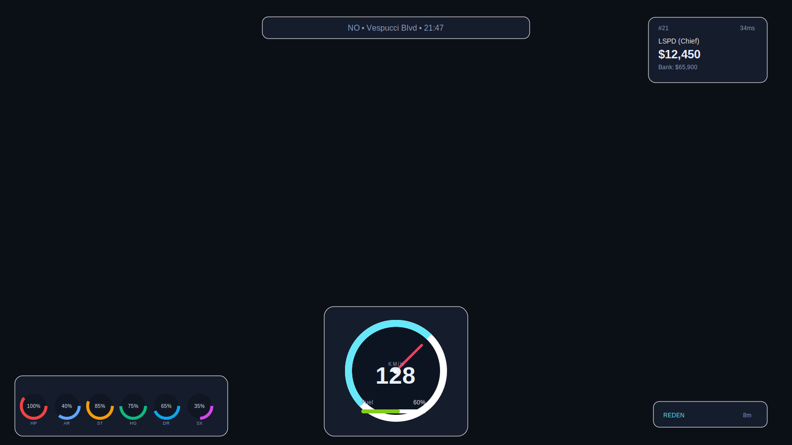

# LN Hyper Modern RP HUD (FiveM)

Modernes HUD für FiveM RP-Server mit Support für:
- ESX
- QBCore
- Standalone (`LocalPlayer.state`)

## Features
- Vitals: Leben, Rüstung, Ausdauer
- RP Needs: Hunger, Durst, Stress
- Identity: Job, Cash, Bank, ID, Ping
- World: Straße, Kreuzung, Richtung, Uhrzeit
- Vehicle: Geschwindigkeit + Sprit
- Voice: Sprechstatus + Reichweite
- `/hud` Command zum Ein-/Ausblenden

## Installation
1. Ordner in `resources/[hud]/ln_hyper_modern_rp_hud` legen.
2. In `server.cfg` hinzufügen:
   ```cfg
   ensure ln_hyper_modern_rp_hud
   ```
3. Optional:
   - `LegacyFuel` für Fuel-Reading
   - `pma-voice` (oder kompatibler State) für Voice-Range

## Data Sources
- QBCore: `PlayerData.metadata`, `PlayerData.money`
- ESX: `ESX.GetPlayerData().accounts` + `LocalPlayer.state`
- Standalone: `LocalPlayer.state`

## Preview

